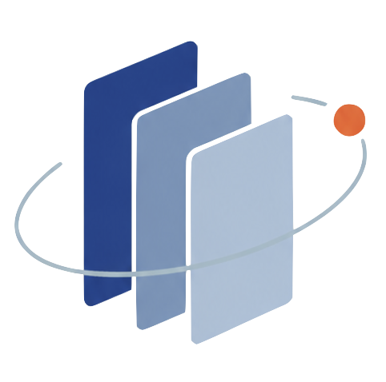

# Research Scout
一个会自己追社区热点和论文，并整理成可视化阅读库的科研 Skill。

## 作者的话

每周想看看社区最近又在研究什么，结果热点散在 GitHub、论文和各种讨论里；好不容易让 AI 全部搜集回来，交付的又是一堆密密麻麻的 Markdown 文件，看着就想下周再说。于是我把它做成了“研究追踪 Skill + 本地阅读器”：定时任务每周自动叫醒 AI，Skill 负责搜、筛、讲人话、跨周去重和归档，阅读器负责把结果变成真正能读、能翻、能收藏的网页。我只负责点开看看，这周学术圈又整了什么新活。

## 功能

- 每周自动追踪 GitHub、论文和社区讨论，提炼真正升温的研究热点。
- 精选五篇近期论文，用类比和白话讲清重要性、动机、创新、验证方法与后续灵感。
- 从本周内容中提出三个可证伪、可以直接开做的研究问题。
- 自动检查历史周报，避免论文和热点换个标题重复出现。
- 按周归档并生成可视化阅读库，支持浏览历史内容和收藏。

## 首次使用

1. 在 Codex 中打开本项目文件夹，并确认该目录已成为当前工作区。
2. 在这个项目的新任务中，将下面的指令发给 AI：

> 请先阅读本项目的 `AGENTS.md`，按照其中的规则创建每周定时任务；然后生成并归档第一期样刊，启动或检查本地阅读器，最后返回可直接打开样刊的网页链接。

## 手动启动

- macOS：双击项目里的 `打开周报.command`。
- Windows：双击项目里的 `打开周报.bat`，会自动启动服务并打开浏览器；如果提示未找到 Node.js，请先安装 Node.js。

启动后访问 [http://127.0.0.1:4178](http://127.0.0.1:4178)，页面会自动读取最新一期归档。

## 切换研究方向

分别确定社区热点和论文导读的关注方向后，将下面的指令发给 AI：

> 请调整本项目的研究方向：社区新闻与研究热点重点关注“<希望追踪的社区话题，例如 Agent、具身智能或多模态>”；论文导读重点关注“<希望深入阅读的论文方向，例如强化学习微调、世界模型或推理加速>”。请先阅读并更新 `AGENTS.md` 中的项目目标、热点范围、检索来源、论文筛选、固定栏目和检查项，并明确区分“社区热点”和“论文导读”的选题范围；保留现有的执行频率、日期窗口、跨期去重、Markdown 归档及网页交付方式。本次只修改研究规则，不创建定时任务，也不生成新周报。
